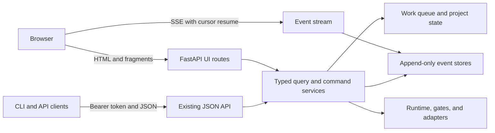

# Agent Harness GUI Implementation Plan

**Status:** Accepted product direction; implementation in progress. Milestones 0–1 and
substantial Milestones 2–3 slices are implemented, as are the Milestone 4 routing,
worker-inventory, event-explorer and typed-analytics slices. Milestones 2–4 remain
partial and Milestones 5–8 remain incomplete.
**Plan date:** 2026-08-05  
**Product boundary:** The GUI is built, packaged, served, tested, and documented entirely
inside `agent-harness`.

**Implementation tree:** branch `codex/gui-plan` at
`/home/sprooty/Working/Active/apps/agent-harness-worktrees/gui-plan`. The browser control
plane is implemented in `src/agent_harness/ui.py`, `query_service.py`,
`browser_session.py`, `templates/`, and `static/`; its in-process journeys are in
`tests/test_ui.py` and `tests/test_ui_packaging.py`. The current tree includes the GUI
foundation commits `264294d` through `a245679` plus an uncommitted continuation containing
the subsequent slices described below. Build and gate results are recorded in
[`docs/evidence/2026-08-05-gui-milestone-0-1.md`](docs/evidence/2026-08-05-gui-milestone-0-1.md).

This worktree is the implementation source of truth for this plan. The repository's
default `main` checkout is not the GUI implementation tree.

## 0. Current implementation status

This section is the resume point as of 2026-08-06. Continue in this worktree; the default
`main` checkout is not the implementation source of truth.

At the start of this continuation, the branch head was `a245679`: four GUI commits ahead of
the merge base and 18 commits behind `main` at `be7abe1`. The Milestone 2–4 continuation was
revalidated and checkpointed as `4059d22`, then current `main` was integrated. The merged
tree passes all four gates with the declared `--all-extras` environment. The first merged
pytest attempt was invalid because this older worktree had not installed the newly declared
`agent-loop` extra; all 38 failures were `ModuleNotFoundError: minisweagent`. After
`uv sync --all-extras`, that failure group and the full suite passed.

### 0.1 Landed foundation

The branch currently points at `a245679` and contains these GUI commits:

1. `264294d feat: add self-contained browser control plane`
2. `8b202a9 feat: add guarded browser control actions`
3. `b759325 docs: record GUI gate evidence`
4. `a245679 feat: add browser inception and graph reviews`

Together they establish the in-repository GUI policy, packaged/authenticated shell,
monitoring views, browser action bridge, item evidence, SSE stream, inception flow, plan
parse review, and typed dependency graph.

### 0.2 Implemented Milestones 2–4 slices

The implementation now includes:

1. project preflight and explicit base-check views;
2. a project configuration editor using the public `ProjectSpec`, secret-safe rendering,
   a server-held one-time review, and an atomic `updated_at` compare-and-set on apply;
3. explicit, revision-scoped dependency overrides with authenticated reason and audit;
4. shared project, plan and routing application services instead of duplicate HTML/API
   behavior;
5. a two-step plan-sync flow: parse and read-only GitHub preview, followed by a separate
   apply bound to the exact plan bytes, persisted project target, and reviewed remote
   counts, with refusal audit for local, project, remote-preview and GitHub failures;
6. shared plan-sync finding gates for JSON and browser clients, including unresolved,
   malformed, cyclic and unattached dependencies;
7. a generic global role-routing editor using a one-time review and atomic setting
   compare-and-set, complete `RoleRoute` field persistence, credential-safe endpoint
   rendering, used/unused explanations and reviewer-independence warnings;
8. a typed worker-pool inventory joining live runtime identities to durable claims,
   leases, heartbeats, stage evidence, failures and project-scoped abandoned sessions,
   while reporting monitoring-only deployments without inventing a registry;
9. URL-backed event filters for project, item, worker, endpoint, role, model, outcome,
   error class, reason kind and time, including filtered SSE resume on the same monotonic
   cursor; and
10. focused in-process journeys for replay, stale project/routing configuration, CSRF,
   preview-without-write, plan mutation, remote preview drift and refused external writes.

### 0.3 Current verification

The complete implementation tree has the following evidence:

| Check | Most recent result |
|---|---|
| `TMPDIR=/tmp/agent-harness-gui-4-8-full.VVKT0C uv run pytest -q` | Passed at 100%, 1 skipped |
| `uv run ruff check .` | Passed |
| `uv run ruff format --check .` | Passed, 132 files checked |
| `TMPDIR=/tmp/agent-harness-gui-4-8-full-mypy.MdANch uv run mypy` | Passed, 127 source files |

The full suite includes the wheel packaging and in-process browser journeys. Browser
automation, accessibility tooling, a forced browser SSE reconnect, real GitHub concurrency,
and real fleet/deployment journeys remain open; the in-process stateful GitHub double does
not prove a transaction across remote preview and writes.

### 0.4 Known limits

1. GitHub has no transaction spanning the second preview and subsequent issue writes. The
   service re-previews immediately before applying and refuses visible drift, but a remote
   actor can still change the backlog between those operations.
2. The role editor is global. Per-project route overrides remain available through project
   configuration but do not yet have a specialized routing comparison view.
3. Milestone 2 still lacks bulk-action review and notification delivery. Milestone 3 still
   lacks the typed adoption HTTP/wizard flow and richer interactive graph controls.
4. Milestone 4 rate-limit, cost, delivery, audit-health, worker inventory and filtered
   event exploration are implemented as read-only typed views. GitHub reconciliation and
   audit maintenance now have explicit reviewed browser actions. Session-independent
   process and gateway-log metrics remain incomplete.

### 0.5 Exact next work

Continue from the reconciled base with Milestone 4.9: expose session-independent process
and gateway-log metrics through typed, redacted APIs. Milestone 4.8 is implemented with
one-time review/apply actions, persisted-project repository resolution and drift refusal,
validated retention parameters, required reasons, authenticated operator audit, and result
pages that retain returned errors. The analytics views now keep
`rpm`, `window_cap`, `terminal_cap` and `unclassified` separate; show supplied baselines and
denominators; keep known spend distinct from unpriced calls; and retain table evidence
behind every summary. Do not mark Milestone 4 complete until every 4.1–4.9 acceptance
requirement is evidenced.

## 1. Product decision

### 1.1 Owner ruling

`agent-harness` owns its GUI. Running `agent-harness serve` will expose both the existing
JSON API and the browser application from the same process and origin.

The GUI has **no dependency on MyDevEnv**. It will not import MyDevEnv code, consume its
assets, use its authentication, require its proxy, depend on its routes, or assume its
session or terminal model. Existing documentation names AIDevEnv as a reference session
host; that host is not a GUI dependency either.

All GUI source, templates, static assets, migrations, tests, and documentation live in this
repository and ship in the `agent-harness` distribution. There is no separate frontend
repository or required frontend service.

This is a new owner ruling. It supersedes only the earlier placement decision that said the
GUI must live in a session host. It does **not** supersede the generic-core rule, the gate
invariants, append-only event history, honest reporting, or settled decisions D1-D14.

### 1.2 Consequence for the repository

The policy-alignment work described here has landed in the implementation tree. The old
host-owned GUI statements were replaced in `AGENTS.md`, `README.md`,
`docs/ARCHITECTURE.md`, `docs/MULTI-PROJECT-PLAN.md`, `docs/USAGE.md`, deployment guidance,
CLI help, the `api.py` module documentation, and API tests. The existing JSON API remains
public and typed; the browser routes are an additional first-party client over the same
FastAPI process and shared services.

The remaining milestones below are implementation work, not a prerequisite policy
rewrite. Acceptance claims must continue to follow the evidence document and must not
promote an unexercised slice to proven behavior.

### 1.3 Reference products

Kiro Crew is the behavioral reference for a persistent multi-session workspace: history,
memory, skills, task execution, schedules, subagents, approvals, notifications, and live
terminal activity. See its [README](https://github.com/kirodotdev/KiroCrew),
[dashboard documentation](https://github.com/kirodotdev/KiroCrew/blob/main/src/kiro_crew/docs/dashboard.md),
and [feature index](https://github.com/kirodotdev/KiroCrew/blob/main/src/kiro_crew/docs/index.md).

Agno is the behavioral reference for a production control plane: persistent sessions,
agent/team selection, streaming, tool-call visualization, reasoning, references, multimodal
output, human approval, traces, audit logs, RBAC, multi-tenancy, scheduling, and
integrations. See the [Agno README](https://github.com/agno-agi/agno) and
[Agno Agent UI](https://github.com/agno-agi/agent-ui).

These are references, not dependencies. Their names, data models, and conventions must not
be hardcoded into generic execution code.

## 2. Outcome and definition of done

The completed product is a responsive control plane for one or many agent-harness projects.
An operator can understand state, act on work, answer holds, inspect evidence, configure
routing, plan projects, and diagnose failures without opening SQLite or reading a log file.

The accepted GUI program is done only when all of the following are true:

1. `agent-harness serve` presents the GUI directly at its own URL; MyDevEnv and AIDevEnv are
   absent from the build, runtime, authentication, routing, and deployment requirements.
2. A fresh wheel or container includes every required template and static asset and makes
   no CDN request for normal operation.
3. The GUI works in monitoring-only mode. Controls that require a supervised executor are
   disabled with the readiness reason shown, not hidden and not allowed to fail later.
4. Projects, work, holds, readiness, dependencies, events, attempts, costs, delivery,
   routes, roles, and audit health can be understood from the GUI.
5. Every state-changing action preserves the same validation and gate behavior as the JSON
   API and records operator identity, intent, outcome, and time.
6. Retry, force start, dependency override, plan sync, GitHub reconciliation, repository
   writes, and destructive maintenance cannot occur through an implicit UI transition.
7. Cost-cap failures remain terminal, unclassified historical rate limits remain separate,
   and unpriced calls remain visibly excluded from known spend.
8. The interface is usable at desktop and phone widths with keyboard-only navigation,
   visible focus, semantic labels, and reduced-motion support.
9. Lost connectivity is visible. Event delivery resumes from the last monotonic cursor
   without silently dropping or duplicating an operator-visible transition.
10. The repository's four gates pass from the root with `TMPDIR` set to a fast volume.
11. A release evidence document records the build under test, checks run, exercised user
    journeys, failures found, and unmet criteria. Unexercised behavior is not called proven.

The session, memory, skills, scheduling, channels, and multi-user capabilities accepted in
the feature review remain in scope. They are sequenced after the operator control plane
because removing the session-host dependency turns those features from UI integration into
new agent-harness subsystems. No feature is dropped; the dependency-aware order changes.

## 3. Scope and non-negotiable constraints

### 3.1 In scope

1. A server-rendered browser application served by the existing FastAPI process.
2. Responsive navigation, project overview, work board, detail views, holds, and events.
3. Safe project, work-item, dependency, plan, routing, and maintenance controls.
4. Inception, plan parsing, dry-run, synchronization, adoption, and dependency views.
5. Operational telemetry, rate-limit classification, cost, delivery, and baselines.
6. A later in-repository session/chat/terminal subsystem with persistent correlation to
   projects, items, and attempts.
7. Later generic extension layers for memory, knowledge, skills, tools, automation,
   channels, RBAC, and recovery.

### 3.2 Out of scope

1. A GUI hosted by or embedded in MyDevEnv, AIDevEnv, or another session host.
2. A second deployable frontend service or a separately versioned frontend repository.
3. Vendor-specific agent, model, log, memory, tool, or session behavior in core modules.
4. Replacing the existing JSON API. It remains a public, typed, documented surface.
5. Rewriting the queue, executor, stores, gates, or 13-stage attempt model for UI
   convenience.
6. Turning `attempts.py` into a workflow engine or adding a third-party gate registry while
   D8 remains open.
7. Fabricating missing history, cost, outcome, or rate-limit classifications to complete a
   chart.

### 3.3 Gate behavior

The gates are the product. The GUI may explain and invoke a gate but may not weaken it,
skip it, make it optional, or infer approval from a visual interaction. Drag-and-drop is
never sufficient authorization for a gate-controlled state change.

Each expensive or externally visible operation must have:

1. a dedicated action, not an incidental navigation gesture;
2. a review screen showing the resolved target and consequences;
3. any required reason, confirmation phrase, resume token, or override token;
4. server-side validation at execution time; and
5. an append-only audit record for success or refusal.

## 4. Current baseline and gaps

The implementation branch now contains the browser foundation and several guarded control
slices. The remaining work must continue to reuse the typed JSON contracts and shared
services rather than growing a second interpretation in HTML controllers.

| Capability | Current state | Required work |
|---|---|---|
| Application shell | Packaged templates/assets, browser sessions, CSRF, navigation and security headers are implemented | Rich error states, reconnect proof, browser/accessibility journeys |
| Work | Board/detail, retry, block, hold answer, typed evidence, readiness, graph and dependency override paths exist | URL-backed filters/sorting, bulk review and remaining refusal journeys |
| Projects | Overview, control actions, preflight/base-check view and reviewed configuration editor exist | Continue/force-start review and complete mutation/refusal parity |
| Holds | Authenticated inbox and structured answer form exist | Draft preservation on expiry/mismatch and notifications |
| Events | SSE over the monotonic cursor and event views exist | Forced reconnect/replay proof, richer filtering and polling fallback evidence |
| Audit | Health, events, cost, delivery, rollups, baselines, maintenance, and reconcile APIs exist | Dashboards, confirmations, reason/operator audit for actions, missing breakdowns |
| Plans | Inception, question gates, generated preview, parse-loss report and uncommitted reviewed plan sync exist | Finish plan-sync review items above; adoption HTTP API and wizard |
| Routing | Role map and route-health APIs exist | Editor, used/unused explanation, independence warnings, secret-safe validation |
| Workers | Project summaries expose counts and failures | Worker/claim/lease/heartbeat/session inventory API |
| Attempts and artifacts | Durable data exists in internal modules | Typed item-scoped API for attempts, stages, patches, diffs, and evidence links |
| Sessions/chat/terminal | Agent-harness can use an optional external session-host protocol | New in-repository generic session subsystem; external-host behavior does not satisfy this plan |
| Memory/skills/tools | No generic product APIs | New extension contracts and installed-metadata boundaries |
| Scheduling/channels | No generic product APIs | New scheduler, trigger, notification, and channel contracts |
| Identity/RBAC | Bearer API plus bounded opaque browser sessions, CSRF and authenticated operator attribution | Later multi-user identity and RBAC |
| Backup/restore | Operational documentation only | WAL-aware snapshot, validation, restore plan, and guarded UI workflow |
| Policy | In-repository GUI ruling and route/test reversal landed | Keep generic-core, gate and append-only invariants enforced |

## 5. Technical architecture

### 5.1 Deployment shape



The browser, HTML routes, JSON API, and event stream are one `agent-harness serve`
deployment. A reverse proxy may provide TLS, but no host application is required.

### 5.2 Route layout

1. `/` redirects an authenticated operator to `/projects` and otherwise to `/login`.
2. `/login` and `/logout` own browser-session establishment and revocation.
3. `/projects`, `/work`, `/holds`, `/plans`, `/events`, `/analytics`, `/sessions`, and
   `/settings` are full-page routes.
4. `/ui/fragments/*` returns HTMX fragments; fragments are never treated as public API.
5. `/ui/actions/*` handles browser form submissions with CSRF validation and delegates to
   the same command services as the JSON API.
6. `/api/*`, `/openapi.json`, `/docs`, `/redoc`, and `/healthz` keep their existing
   contracts and purposes.
7. `/api/events/stream` adds SSE without changing `/api/events` cursor semantics.
8. `/assets/*` serves versioned, immutable files packaged with the Python distribution.

All URL construction must honor FastAPI's `root_path`; templates must use named routes
rather than concatenate deployment prefixes.

### 5.3 Frontend stack

The settled D5 stack remains the baseline: Jinja templates, HTMX interactions, and SSE
updates. There is no Node build step in the normal development loop.

1. HTML is rendered server-side with semantic landmarks and progressively enhanced forms.
2. HTMX and any small supporting libraries are vendored, version-pinned assets. The GUI
   must not depend on a CDN or execute unpinned remote code.
3. CSS uses repository-owned design tokens for color, spacing, typography, state, focus,
   and responsive layout. Dark and light themes honor system preference and operator choice.
4. Small behavior that HTMX does not cover is plain, typed/documented JavaScript kept at a
   narrow boundary.
5. Charts and graphs must retain accessible table/list equivalents.
6. The later terminal view may use a vendored terminal renderer and WebSocket transport;
   that exception does not introduce a separate frontend build or service.

### 5.4 Application-service boundary

HTML controllers must not reproduce business rules and must not read SQLite directly. The
current API handlers contain some inline query and command logic, so each GUI slice first
extracts only the relevant logic into a typed application service, leaving the public API
response unchanged. This is module movement and reuse, not a rewrite.

Both JSON and HTML paths must therefore reach the same:

1. authorization decision;
2. resolved project/item target;
3. gate or readiness check;
4. state transition;
5. exception-to-user-error mapping; and
6. audit event.

Pydantic API schemas remain the external contract. UI-specific view models may add labels,
URLs, and presentation state, but they cannot become another source of truth.

### 5.5 Browser authentication and action security

The JSON API keeps bearer-token authentication. The browser must never place that bearer
token in a URL, rendered page, JavaScript bundle, browser storage, or log.

Milestone 1 will add a browser login exchange:

1. `POST /login` validates the configured harness token over TLS or loopback.
2. A successful login creates a bounded, opaque server-side session and sets an `HttpOnly`,
   `SameSite=Strict` cookie. Restart, logout, expiry, or harness-token rotation revokes it.
3. Each browser session has a CSRF token. Every state-changing browser request requires it;
   `Origin`/`Referer` checks provide defense in depth.
4. Failed login attempts are rate-limited without recording the supplied credential.
5. Single-operator mode uses the authenticated session's configured identity, not a free
   text `who` field, for audit attribution.
6. The later RBAC milestone replaces the single identity with authenticated users and
   project-scoped permissions without weakening these protections.

OpenAPI and documentation routes remain public as currently required. Data, HTML views,
fragments, streams, and actions fail closed when no harness token is configured.

### 5.6 Live updates

SSE is a delivery optimization over the append-only event cursor, not a new state store.

1. A client reconnects with `Last-Event-ID` or an explicit cursor.
2. The server replays events after that cursor, then streams new events and heartbeats.
3. Duplicate delivery is tolerated by event ID; a cursor gap is surfaced as degraded
   history, not hidden.
4. Exponential reconnect is client-local and never pauses a worker or another browser.
5. Polling `/api/events` remains the fallback when streaming is unavailable.
6. HTML actions return their authoritative result immediately; the UI does not wait for an
   eventually delivered event to decide whether the action succeeded.

### 5.7 Packaging and content security

Templates and assets are package data covered by a wheel-install smoke test. Production
responses set a restrictive Content Security Policy, `frame-ancestors`, MIME-sniffing,
referrer, and cache headers. User/model text is escaped by default; Markdown is sanitized;
tool output, patches, logs, and ANSI terminal content are treated as untrusted input.

## 6. Delivery milestones

Milestones are ordered by dependency. A milestone is complete only when its acceptance
criteria and repository gates pass; partially implemented screens do not make it complete.

### Milestone 0 — Align policy and preserve the baseline

**Goal:** Make the new product ruling unambiguous before adding HTML.

0.1. Replace the `AGENTS.md` "Do not add a GUI here" section with the in-repository GUI
boundary and the no-MyDevEnv rule.

0.2. Update `README.md`, `docs/ARCHITECTURE.md`, `docs/MULTI-PROJECT-PLAN.md`,
`docs/USAGE.md`, `docs/DEPLOYMENT.md`, CLI help, `api.py` documentation, and package
description where they claim the service is headless or host-rendered.

0.3. Replace `test_there_is_no_html_anywhere` with tests that require `/` or `/login`, keep
all `/api/*` responses JSON, and keep OpenAPI/docs discoverable.

0.4. Record the route, auth, service-layer, asset, CSP, and root-path decisions in the
architecture documentation.

0.5. Run and record all four gates before feature work to establish an honest baseline.

**Acceptance:** No active repository instruction or test forbids an agent-harness GUI; no
runtime behavior other than the deliberately updated route expectation has changed; the
baseline results are recorded.

### Milestone 1 — Secure application shell and read-only operator slice

**Goal:** Deliver a useful, self-contained GUI that cannot mutate execution state.

1.1. Add packaged Jinja templates, CSS, vendored HTMX, icons, and asset manifest.

1.2. Implement login, logout, opaque browser sessions, CSRF tokens, security headers, and
root-path-safe URL generation.

1.3. Build the responsive shell with Projects, Work, Holds, Events, Analytics, Plans,
Sessions, and Settings navigation; project switcher; command palette; theme; focus
management; reconnect status; and global state badges.

1.4. Build project cards showing queue counts, control/previous state, reason, workers,
worker failures, stale claims, draining items, readiness, and audit degradation.

1.5. Build the work board as a grouped list first. Group pending, claimed, held, blocked,
failed, exhausted, and done; put holds first; add URL-backed search, filters, and sorting.
Kanban can be a later presentation of the same query.

1.6. Build work-item detail with specification, issue, dependencies, branch, PR, lease,
attempt count, budgets, known spend, unpriced calls, latest session evidence, disposition,
reason, and readiness explanation.

1.7. Add item-scoped typed APIs for event timeline, durable attempt/stage history, outcomes,
and retained patch/artifact metadata. Render them without inventing unavailable evidence.

1.8. Build the holds inbox with question, reason, age, expiry, allowed answerer, item link,
and optional session evidence. Answering remains disabled until Milestone 2.

1.9. Add SSE cursor resume, live status updates, and polling fallback. A disconnected banner
must distinguish stale displayed data from current state.

1.10. Add empty, unconfigured, monitoring-only, degraded-audit, loading, 401/403, 404, 409,
422, and 5xx states with actionable explanations.

**Acceptance:** From a wheel-installed `agent-harness serve`, an authenticated operator can
inspect every project and item, find every open hold, follow live events through a forced
disconnect/reconnect, and diagnose fixture failures without MyDevEnv, a CDN, or direct
database access. The current implementation has exercised these read paths; later browser,
screen-reader, reconnect, and release journeys remain open.

### Milestone 2 — Explicit controls and human-in-the-loop actions

**Goal:** Make the read-only control plane safely operable.

2.1. Add per-project Continue, Pause, Drain, Stop, and Resume command contracts. Preserve
the explicit human-resume rule after every process restart; never auto-start a project.

2.2. Build project preflight and base-check views. Force start, base checks, and readiness
overrides require a review dialog that shows every blocker and warning.

2.3. Build the project configuration editor for repository, checkout, base branch, checks,
fixes, role routes, worker limit, attempt limit, wall-clock budget, spend ceiling, disk
floor, plan path, hold expiry, and durability. Secret values are never echoed. The current
slice validates the public `ProjectSpec`, holds a one-time review server-side, audits the
apply, and refuses replay or stale persisted versions; bulk editing and richer route review
remain open.

2.4. Implement Retry, Block, Answer, and revision-scoped Dependency override forms. Add any
missing reason/operator fields to typed API requests and record their audit outcomes.

2.5. Answer forms support text and structured JSON. Resume-token expiry and mismatch return
the server's precise error without discarding the operator's unsent draft.

2.6. Add safe bulk selection for actions whose server contract can validate every target.
Show a dry-run result and refuse the whole batch when atomic safety cannot be guaranteed.

2.7. Add browser notifications for holds, failures, and completion after explicit
permission. Notification delivery is a convenience; the holds store and event stores remain
authoritative.

2.8. Append audit events for operator identity, target, submitted reason, command outcome,
and timestamp. Do not log bearer tokens, resume tokens, CSRF tokens, or secret fields.

**Acceptance:** Every supported mutation can be completed from the GUI and produces the same
result and refusal behavior as the JSON API. Tests prove that live claims cannot be raced,
cost caps are never retried, invalid resume tokens do not answer holds, blockers prevent
ordinary starts, and restart never auto-resumes a project.

**MVP boundary:** Milestones 0-2 are the first releasable GUI.

### Milestone 3 — Inception, plan lifecycle, adoption, and dependencies

**Goal:** Let an operator bring work into the harness without hiding parsing or decision
loss.

3.1. Build the "Describe a project" inception wizard using the existing draft, scope,
revision, question-resolution, approval, and generated-plan contracts.

3.2. Show goal, assumptions, non-goals, risks, phases, work-item count, feedback revisions,
and open blocking/deferrable questions. Refuse approval while blocking questions remain.

3.3. Render generated `PLAN.md` before initialization and allow download/copy without
creating queue rows.

3.4. Build the plan workflow: Parse -> show skipped headings, duplicates, malformed and
unresolved dependencies, cycles, and external/cross-project edges -> dry-run -> explicit
Sync.

3.5. Keep plan sync non-destructive. Real GitHub writes require a second confirmation that
shows repository and exact create/update/orphan counts.

3.6. Add a typed HTTP adoption proposal API around `adoption.py`, then build the adoption
wizard. A proposal is never a decision: nothing is dropped unless the operator names it.

3.7. Build an accessible dependency graph with zoom, pan, search, item focus, and a list
equivalent. Distinguish local work, external references, human decisions, cross-project
dependencies, advisory edges, satisfied edges, blocked edges, unresolved edges, and cycles.

3.8. Show resolver status/evidence and the exact item-readiness explanation. Overrides are
revision-scoped and require authenticated identity and reason.

**Acceptance:** A fixture project can be scoped, revised, approved, parsed, dry-run, synced,
and adopted without silent loss. Blocking questions and dependency cycles prevent the
corresponding gated action. External writes occur only after the confirmed non-destructive
preview.

### Milestone 4 — Routing, workers, operations, and analytics

**Goal:** Complete the production control-plane view.

4.1. Build a generic role-routing editor for registered roles. Show model fallback order,
route preset, endpoint, provider identity, price reference, and whether the active executor
actually uses the role.

4.2. Validate routes without exposing credentials. Warn when reviewer and implementer lack
model/vendor independence; do not silently rewrite the operator's routing choice.

4.3. Add a typed worker-pool API and view for worker identity, project, item, claim, lease,
heartbeat, stage, start time, failure, and abandoned-session evidence.

4.4. Build the event explorer with project, item, worker, endpoint, role, model, outcome,
error class, reason kind, and time filters while preserving cursor order.

4.5. Build rate-limit panels that keep `rpm`, `window_cap`, `terminal_cap`, and
`unclassified` separate. Display the supplied baseline and denominator beside comparisons.

4.6. Build cost panels by project, role, model, and window. Known spend and unpriced calls
must be visually and semantically separate.

4.7. Build delivery panels for completed, failed, merged, closed-unmerged, and reverted
work; audit-health panels for missing, degraded, or partial history; and daily rollup and
baseline comparisons.

4.8. Add confirmed GitHub reconciliation and audit maintenance actions. Show the resolved
repository, retention parameters, dry-run where supported, and returned errors. Implemented:
both operations share application services with the JSON API and use a non-mutating,
one-time browser review. Neither underlying operation supports a dry run, so the review
states that honestly. Reconciliation is project-scoped and refuses repository drift;
maintenance binds the validated retention window. Both require a reason and a healthy
append-only audit store, record success/refusal with authenticated identity, and display
all returned errors.

4.9. Add session-independent process metrics and agent-harness gateway logs through typed,
redacted APIs. Never make local filesystem log paths a core convention.

**Acceptance:** An operator can explain fleet state, failure classes, route use,
reviewer-independence risk, cost caveats, delivery outcomes, worker leases, and audit health
from the GUI. Every chart has a raw/table route to the evidence behind it.

**Control-plane v1 boundary:** Milestones 0-4 deliver the independent agent-harness GUI for
the capabilities the service substantially owns today.

### Milestone 5 — Agent-harness-owned sessions, chat, and terminal

**Goal:** Deliver the accepted workspace features without delegating the GUI to MyDevEnv or
another host.

This milestone begins with a separate design review because the current session-host client
is an execution adapter, not an agent-harness session product. External session URLs may be
shown as evidence before this milestone, but they do not satisfy its acceptance criteria.

5.1. Define generic session, message, attachment, tool-call, terminal-stream, and correlation
protocols. Core types must not name a vendor or import an adapter.

5.2. Add an in-repository session registry and durable session metadata: project, item,
attempt, working directory, process state, timestamps, title, pin, folder, color, and parent
session.

5.3. Add a guarded local process/PTY backend with explicit registered-work-directory
boundaries, resize, bounded scrollback, cooperative stop, exit reporting, and audit events.
Running a command uses the harness OS identity and is presented as a high-impact action.

5.4. Add typed HTTP/SSE/WebSocket contracts for history, output, input, resize, stop, and
resume. Authenticate every connection; remote session links are scoped and short-lived.

5.5. Build multiple session tabs, history, search, resume, rename, pin, folders, colors, and
fork-with-context.

5.6. Render streaming Markdown, highlighted code, diagrams, file paths, tool calls/results,
reasoning, and references only where the provider supplies typed data. Sanitize all output.

5.7. Add queued-message editing, reordering, cancellation, regeneration, and cooperative
stop with explicit server acknowledgements.

5.8. Build the terminal pane with live output, working directory, resize, copy, and
send-selection-to-chat.

5.9. Add file uploads and multimodal input/output with type, size, storage, scanning,
retention, and redaction policies before enabling them.

5.10. Make item -> attempt -> session correlation durable and link both directions. The
work-item detail route points to the internal session workspace when one exists.

**Acceptance:** All session acceptance journeys run against `agent-harness serve` alone.
No MyDevEnv/AIDevEnv process, route, token, asset, or proxy appears in the test or deployment
topology. Killing and restarting the GUI process preserves session metadata and honest
process-exit state; it never pretends a dead PTY is resumable.

### Milestone 6 — Memory, knowledge, skills, tools, and extensions

**Goal:** Add the accepted extension layer behind generic contracts.

6.1. Define project-scoped context/preferences and inspectable lessons/corrections with
global versus project scope and explicit provenance.

6.2. Add persistent, incognito, and temporary session policies with visible retention and
deletion behavior.

6.3. Add knowledge-source upload, ingestion status, semantic search, and citations through
an adapter boundary. Source text and citation provenance remain inspectable.

6.4. Add skills CRUD, version history, enable/disable, and project/agent assignment.

6.5. Add an MCP/tool registry with capability discovery, health, and project/agent scope.
Tool registration must not become a gate-registration mechanism while D8 is unresolved.

6.6. Define a host-independent GUI extension boundary using installed metadata. Extensions
may contribute declared pages/panels and typed data, but cannot bypass auth, CSP, audit, or
command services.

6.7. Keep adapter modules lazy and opt-in. Extend `tests/test_generic.py` so the relevant
GUI execution path cannot import or contain dotted paths to shipped adapters.

**Acceptance:** A third-party distribution can install one knowledge/tool/GUI extension by
metadata without editing core, and a clean installation without it behaves identically.
Extension failure is isolated and visibly degraded rather than taking down the control
plane.

### Milestone 7 — Automation and external surfaces

**Goal:** Add scheduled and reactive work without creating hidden execution.

7.1. Add one-shot, interval, and cron schedules with timezone, skip dates, next-run preview,
pause/resume, owner, and project scope.

7.2. Add background task specifications with step progress, checkpoint resume, refinement,
and cancellation. Reuse fixed attempt stages where applicable; do not turn them into a
general workflow language.

7.3. Add authenticated, replay-protected webhook and CI triggers with explicit mapping to a
project/action and an immutable receipt.

7.4. Add a generic notification/channel adapter contract for browser and optional external
surfaces. Shared continuity uses session IDs and typed messages, not a vendor-specific
channel model.

7.5. Build Schedules, Triggers, Runs, Channels, and notification-routing views with preview,
pause, failure, and last/next-run state.

7.6. Preserve explicit execution policy: a schedule or trigger is itself an approved source
of intent, recorded at creation and at every run. It cannot imply dependency override,
force start, or external write authority not present in its specification.

**Acceptance:** Timezone/DST, missed-run, duplicate-webhook, pause, restart, checkpoint, and
cancellation tests prove at-most-once admission where promised and honest duplicate status
where external delivery cannot guarantee it.

### Milestone 8 — RBAC, governance, and recovery

**Goal:** Make the independent GUI safe for deployments with multiple operators and formal
recovery requirements.

8.1. Add optional users, roles, and project isolation while keeping a simple single-operator
deployment supported.

8.2. Define permissions for read, operate, answer, override, configure, synchronize,
administer, and open remote sessions. Enforce them in shared command services, not only in
templates.

8.3. Display effective approval policy: allowed, denied, sensitive path, sandbox, and
redaction status.

8.4. Build an immutable audit view for operator, agent, tool, schedule, webhook, and
external-effect actions.

8.5. Add short-lived, scoped, revocable remote session links with explicit expiry and
single-use options.

8.6. Add WAL-aware snapshot and restore workflows: resolve exact files, checkpoint safely,
create a recoverable snapshot, validate integrity, rehearse restore into a separate target,
and require an explicit final cutover.

8.7. Add backup age, integrity, restore rehearsal, auth failure, denied action, and session
revocation panels without exposing sensitive values.

**Acceptance:** Authorization tests prove horizontal and vertical isolation through both
HTML and JSON paths. A documented backup/restore exercise succeeds on a disposable fixture,
and a failed integrity check cannot overwrite the active stores.

## 7. Feature-to-milestone traceability

| Accepted feature group | Delivery |
|---|---|
| 1. Application shell and navigation | Milestone 1 |
| 2. Project overview and control center | Milestones 1-2 |
| 3. Work board | Milestones 1-2 |
| 4. Work-item detail | Milestones 1-2; session link completed in 5 |
| 5. Session and chat workspace | Milestone 5 |
| 6. Human-in-the-loop inbox | Milestones 1-2 |
| 7. Project inception and plan lifecycle | Milestone 3 |
| 8. Dependency and readiness visualization | Milestone 3 |
| 9. Agent, role, and worker orchestration | Milestone 4; subagent tree awaits a generic API |
| 10. Operations, telemetry, and analytics | Milestone 4 |
| 11. Memory, knowledge, skills, and tools | Milestone 6 |
| 12. Automation and external surfaces | Milestone 7 |
| 13. Security, governance, and recovery | Foundations in 1-2; full scope in 8 |

## 8. Test and evidence strategy

### 8.1 Tests required with each slice

1. Unit tests for extracted query/command services and presentation view models.
2. In-process ASGI tests for HTML status, auth, CSRF, headers, root path, JSON isolation,
   fragments, redirects, error mapping, and action parity.
3. Source-derived authorization tests so every new protected HTML, fragment, stream, and
   action route is covered automatically, as API routes are today.
4. Browser journeys for login/logout, navigation, project switching, filters, reconnect,
   keyboard operation, modal focus, form-error preservation, and each high-impact action.
5. Accessibility checks plus manual keyboard and screen-reader smoke tests at release gates.
6. Security tests for XSS through model/log/Markdown fields, CSRF, cookie flags, token
   leakage, open redirects, path traversal, upload handling, WebSocket authorization, and
   CSP.
7. Concurrency tests for stale page submissions, lease changes between review and confirm,
   duplicate clicks, stream reconnect, and simultaneous operators.
8. Packaging tests that build/install the wheel in a clean environment and request every
   template and hashed asset without repository files present.
9. Genericity tests over the GUI execution path using the authoritative `EXECUTION_PATH` in
   `tests/test_generic.py`.
10. Regression tests proving the JSON API and OpenAPI remain typed, documented, and
    backward-compatible.

Browser tests may add a browser runtime to CI, but the application build itself remains
Node-free. The four repository gates remain mandatory; browser/a11y/security journeys are
additional release gates, not substitutes.

### 8.2 Evidence per milestone

Each milestone produces `docs/evidence/YYYY-MM-DD-gui-milestone-N.md` containing:

1. commit and configuration under test;
2. commands run and whether `TMPDIR` was on a fast volume;
3. API/schema changes;
4. user journeys exercised and viewport/input methods used;
5. before/after measurements where the milestone changes an operational metric;
6. observed failures and fixes;
7. security and accessibility results;
8. screenshots only as supporting evidence, never as the sole assertion; and
9. unmet criteria and follow-up work stated plainly.

## 9. Rollout plan

1. Ship Milestone 1 first to a disposable demo database in monitoring-only mode.
2. Exercise read paths and reconnect behavior before enabling mutations.
3. Enable Milestone 2 controls against a fixture repository; verify every refusal and audit
   event before using a real repository.
4. Run the MVP against a real but non-critical project and preserve evidence. Do not call
   it fleet-proven; the harness has not run against a real fleet yet.
5. Deliver Milestones 3 and 4 after MVP evidence closes their API gaps.
6. Treat Milestone 5 as a subsystem release with a separate threat model and migration
   plan; do not smuggle PTY ownership into an ordinary UI increment.
7. Deliver extension, automation, and multi-user milestones only after their generic
   protocols and failure-isolation tests exist.

Direct deployment is the supported shape:

```console
HARNESS_TOKEN=replace-me uv run agent-harness --db harness.sqlite serve --port 8099
```

The operator opens the agent-harness URL directly. A conventional reverse proxy may add
TLS and a path prefix, but MyDevEnv/AIDevEnv is never part of the topology.

## 10. Risks and controls

| Risk | Control |
|---|---|
| Old no-GUI guidance remains active | Milestone 0 changes policy, docs, help, and enforcement before code |
| HTML and JSON paths implement different rules | Shared typed query/command services and parity tests |
| Browser auth leaks the bearer token | Opaque server session, HttpOnly cookie, CSRF, no URL/storage/rendered token |
| UI hides a gate or turns it into a gesture | Review screens, server-side revalidation, reasons/tokens, append-only audit |
| SSE loses or duplicates events | Monotonic cursor replay, ID deduplication, gap warning, polling fallback |
| Templates or charts fabricate completeness | Preserve partial/unclassified/unpriced caveats and expose raw evidence |
| GUI introduces vendor coupling | Extend `EXECUTION_PATH` genericity tests; adapters only through metadata |
| Packaged install lacks frontend files | Clean-wheel asset and route smoke test |
| Session scope overwhelms the control plane | Deliver it as Milestone 5 after a protocol/threat-model review |
| Terminal or Markdown output executes hostile content | Sanitization, restrictive CSP, bounded PTY protocol, no raw HTML trust |
| Root-path or proxy deployment breaks links/streams | Named routes and explicit prefixed deployment tests |
| Multi-user permissions exist only in presentation | Enforce in shared services and test HTML and JSON paths |
| Backup action damages the active database | WAL-aware snapshot, separate-target rehearsal, integrity gate, explicit cutover |

## 11. Decisions carried forward

1. The GUI location is settled by this plan: inside `agent-harness`, independent of
   MyDevEnv/AIDevEnv.
2. D5 remains the implementation stack: Jinja + HTMX + SSE, server-rendered, no Node build
   in the iteration loop.
3. The JSON API remains public and typed; the GUI is an additional first-party client over
   shared application services.
4. Browser authentication uses an opaque session derived from a successful bearer-token
   login; it does not expose the bearer token to frontend code.
5. The first releasable GUI is Milestones 0-2. The control-plane v1 is Milestones 0-4.
6. Session/chat/terminal remains accepted but moves to Milestone 5 because it can no longer
   reuse a host UI or host session subsystem.
7. D8 remains open. GUI extensions, tools, or MCP registration must not create a third-party
   gate registry by accident.
8. D9 remains blocked on issue #84. GUI work must not move the review prompt into a stage
   variable to make it editable.
9. Events remain append-only and the audit store remains the source of historical truth.
10. A restart never resumes execution without an explicit human action.
