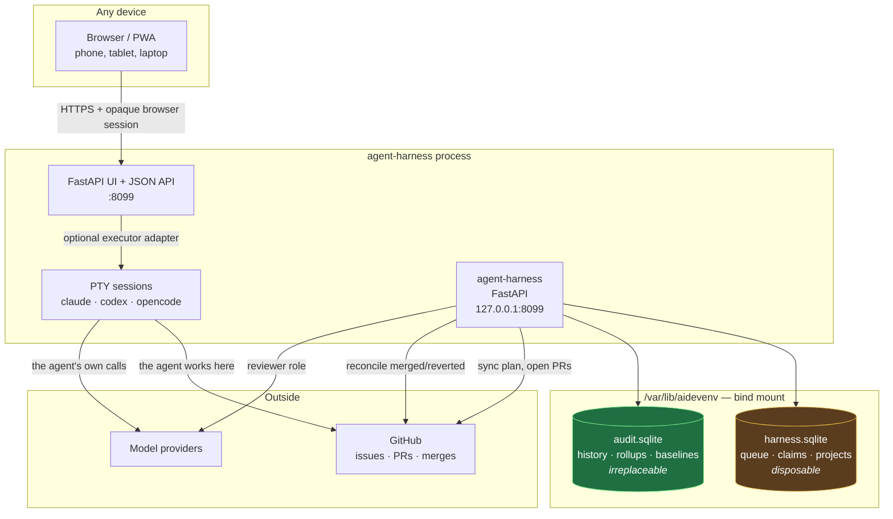
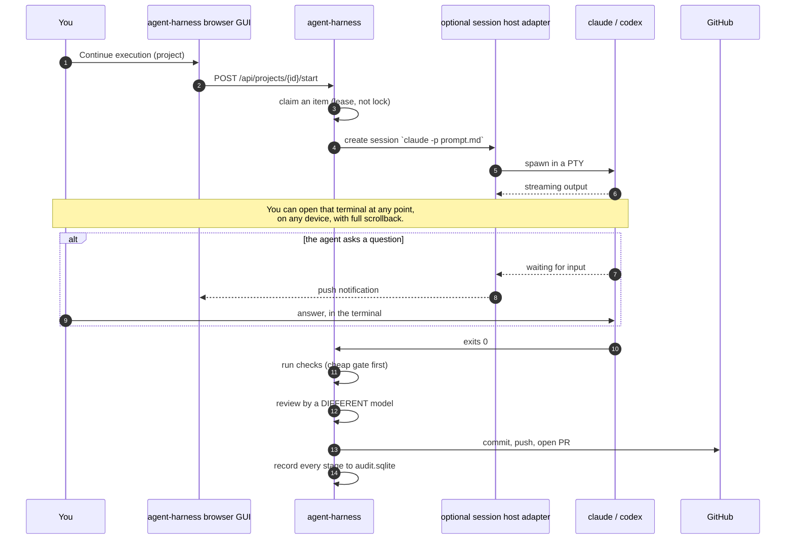
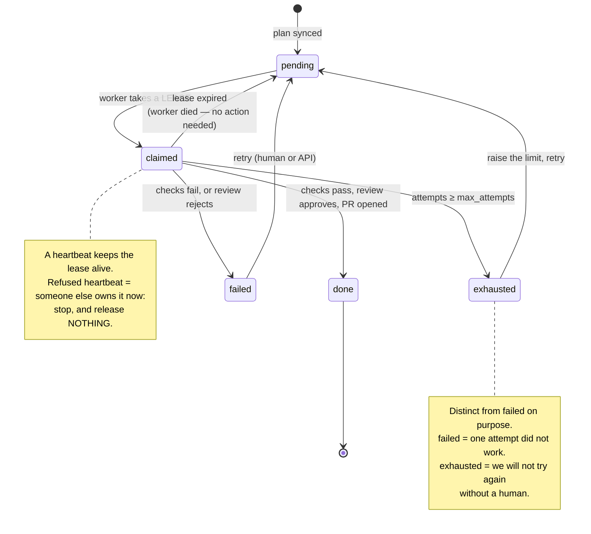
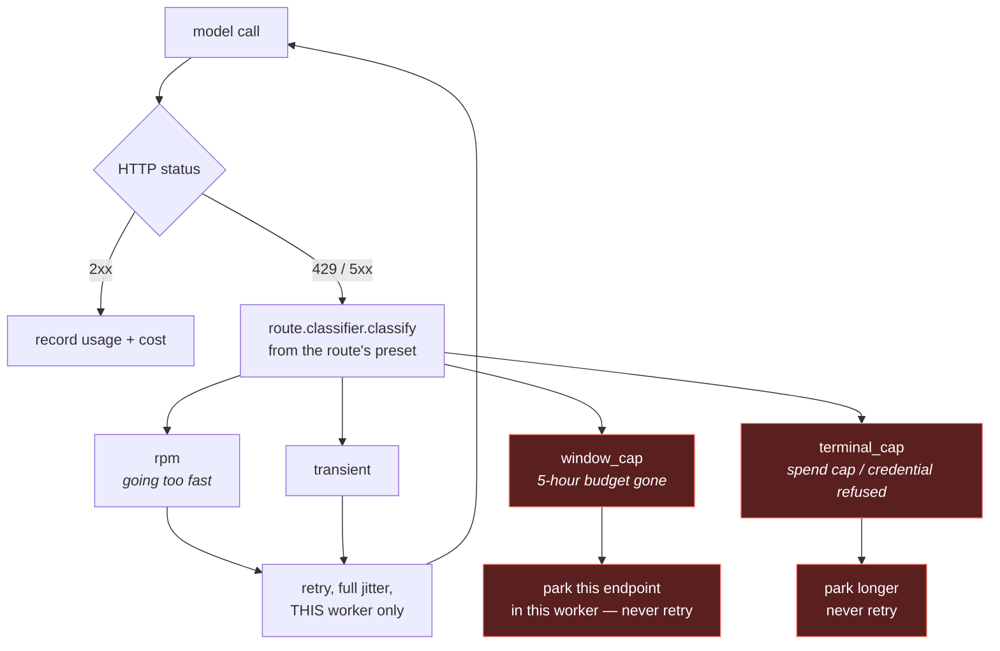
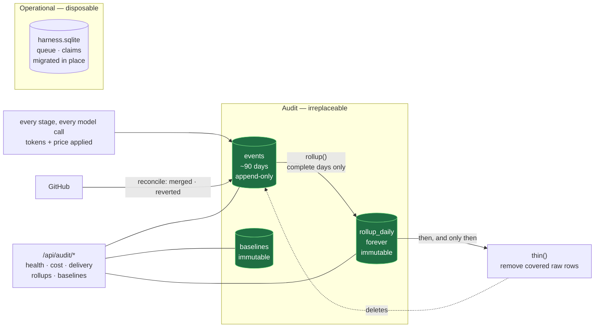
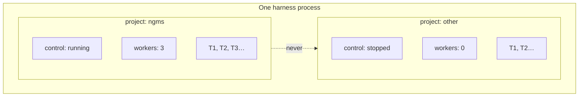

# Architecture

How the agent-harness JSON API, browser control plane and execution adapters fit
together, and what happens inside the harness when work runs. The GUI is owned,
packaged and served by this repository; MyDevEnv and AIDevEnv are not required.

Every diagram here describes what the code does today. Where something is
planned but not built, it says so.

---

## 1. The whole system

One service, one origin. agent-harness owns the browser, authentication, queue,
audit history and JSON API. An optional session host owns PTY processes only;
the harness reaches it through a generic execution protocol and remains usable
in monitoring-only mode without it.



**Why the browser lives here.** The operator needs one URL, one source of truth
and one security boundary. Server-rendered templates and packaged assets are a
first-party client over shared typed query/command services; templates never
read SQLite or bypass gates. An optional session host can still provide a PTY,
but it does not provide the GUI, browser auth, proxy or deployment topology.

**Why two databases.** The queue is mutable, gets migrated in place, and is a
reasonable thing to delete and rebuild from the plan. Anything sharing that
file shares that fate — so history does not.

---

## 2. What an agent actually is

The distinction that makes this different from calling an API in a loop: an
agent is a **process in a terminal you can attach to**, not a request you wait
on.



**Waiting is not failure.** An agent sitting at a prompt is idle and very much
not finished, so completion is the process exit code — never idleness. An
agent that stops to ask surfaces as `waiting_for_input` and sorts to the top
of the Work tab, because it is the one state that needs a person.

**A timeout does not kill the session.** It holds the agent's context, which
is the only thing that makes the item resumable by a human. It is recorded
instead, and reaped later if nobody comes back to it.

---

## 3. Harness components

```mermaid
graph LR
    subgraph ingest["Getting work in"]
        inc["inception.py<br/>paragraph → PLAN.md<br/><i>never queue rows</i>"]
        plan["plan.py<br/>markdown → items<br/><i>reports what it could NOT read</i>"]
        adopt["adoption.py<br/>what is already done<br/><i>proposes, never decides</i>"]
        gh["github.py<br/>items → issues<br/><i>idempotent, marker-matched</i>"]
    end

    subgraph core["Doing the work"]
        work["work.py<br/>queue, leases, projects<br/>control per project"]
        graph["graph.py<br/>typed dependencies<br/><i>unresolved = blocked</i>"]
        fleet["fleet.py<br/>worker pool per project"]
        sx["session_executor.py<br/>agent in a terminal"]
        ex["executor.py<br/>direct API calls"]
    end

    subgraph govern["Deciding and bounding"]
        out["outcomes.py<br/>what a gate answered<br/>what stopped an item"]
        att["attempts.py<br/>where an attempt got to<br/><i>resume, do not re-pay</i>"]
        bud["budgets.py<br/>wall clock · spend<br/><i>per item</i>"]
        hold["holds.py<br/>waiting on a person"]
    end

    subgraph model["Talking to models"]
        mc["model_client.py<br/>role → model routing<br/>per-worker jittered retry"]
        proto["protocols.py<br/>route presets:<br/>wire · auth · reader · classifier<br/><i>resolved by name</i>"]
        prov["providers.py<br/>classify a failure:<br/>burst · window · cap · refused"]
        price["pricing.py<br/>tokens + the price applied"]
    end

    subgraph record["Remembering"]
        store["store.py<br/>live event view"]
        audit["audit.py<br/>append-only history"]
        maint["maintenance.py<br/>rollup → thin"]
        recon["reconcile.py<br/>merged · reverted"]
    end

    api["api.py<br/>documented HTTP + OpenAPI"]

    inc --> plan
    adopt --> work
    plan --> gh --> work
    work --> graph
    work --> fleet --> sx & ex
    sx & ex --> mc --> proto --> prov & price
    sx & ex --> out & att & bud & hold
    sx & ex --> store & audit
    maint --> audit
    recon --> audit
    api --- work & audit & fleet & hold
```

**`doctor.py`** sits outside all of it and reads: route completeness, resolved
protocol and classifier, checkout, whether a check command can even start,
reviewer independence, cost visibility, budgets, and whether anything here can
mutate GitHub. It contacts nothing. **`demo.py`** builds a whole one of these
in a temporary directory with a scripted transport, which is how the first-run
path needs no credentials.

**`adapters/otlp.py`** projects the event stream to OpenTelemetry spans, opt-in
and export-only. It is deliberately not in any subgraph above: nothing reads
back from it.

| Module | Job |
|---|---|
| `inception` | A paragraph → a proposed scope you argue with → a `PLAN.md`. Blocking questions refuse approval; nothing external exists until you approve |
| `plan` | Markdown → work items, reporting what it could **not** read |
| `adoption` | A project already part-built → a proposal about what is already done, ranked by evidence. **Nothing is dropped unless a human names it** |
| `github` | Items → issues, idempotently; re-running an edited plan updates rather than duplicates |
| `work` | The queue. Claims are **leases**; projects, control state, `max_attempts` |
| `graph` | Typed dependencies. A required target it cannot resolve **blocks** rather than being assumed satisfied |
| `fleet` | One worker pool per project, so no project starves another |
| `session_executor` | Runs an item as a CLI agent in an attachable terminal |
| `executor` | The same loop for direct API calls, plus the diff-apply tolerance ladder |
| `model_client` | Routes **roles** to models; per-worker jittered retry; per-endpoint parking |
| `protocols` | What a route is made of — wire protocol, auth, response reader, classifier — and the registry that resolves a preset by name without importing an adapter |
| `providers` | Classifies a failure — burst limit vs spent window vs spent cap vs refused |
| `pricing` | Token usage, and the price that was applied to it. **Unknown is never zero** |
| `outcomes` | What a gate answered (five check outcomes) and what stopped an item (five dispositions). Not `providers` — that is what a *provider* answered |
| `attempts` | One durable row per stage an attempt reached, so a killed worker resumes rather than re-paying for the planner and implementer |
| `budgets` | Per-item wall-clock and spend ceilings. **Not** a provider cost cap, and never parks an endpoint |
| `holds` | An item waiting on a person: durable, survives worker death, answerable from any process |
| `preflight` | Whether a project could finish an item at all — refuses a start rather than failing every item |
| `doctor` | The same questions, asked earlier and for the whole deployment, spending nothing |
| `audit` | Append-only history, its own database, no mutation surface |
| `maintenance` | Rolls up complete days, then thins what is covered |
| `reconcile` | Merged / closed / reverted, fetched from GitHub |
| `api` / `ui` | Typed HTTP API + Swagger and packaged server-rendered GUI |

---

## 4. The life of one work item



**Claims are leases, not locks.** A lock held by a dead process is a lock
nobody can release, and the usual workaround — a human clearing stale state —
is exactly the unattended failure the queue exists to prevent. A worker killed
mid-item releases its work by doing nothing.

---

## 5. Failure handling: a 429 is not one thing



Getting this wrong is expensive in both directions. Retrying a spent cap is a
busy-wait that burns quota checking whether quota exists. And a **fleet-wide**
cooldown in response to one worker's 429 does not merely stall the fleet — it
phase-locks it, so every worker wakes together, bursts together and is limited
together, which is precisely the shape a rate limiter exists to reject.

So: classify first, never retry a cap, keep every reaction **per worker and
per endpoint**, and jitter the backoff.

**Which classifier reads it is a property of the route, not of this diagram.**
A route names a preset, and the preset supplies the wire protocol, the
authentication strategy, the response reader and the classifier together — so a
gateway that states its reasons in a body brings the reader for them along with
the shape it speaks. The core preset is generic and can only see HTTP, which
means it calls a spend cap `rpm`; that is a documented limit rather than a bug,
and `tests/test_route_conformance.py` asserts it as one. Adding a vendor is a
preset registered by name, with no core module changed and none importing it —
see [`INTERNALS.md`](INTERNALS.md#route-presets-adding-a-vendor-without-touching-core).

---

## 6. The audit layer



Four rules, each of which is a property rather than an intention:

| Rule | Why |
|---|---|
| **Roll up, then thin — never thin alone** | Thinning first is silent data loss that leaves a tidy-looking database and a hole in the series |
| **Never rewrite history to fit a new schema** | A backfill is indistinguishable from falsification afterwards; once done, no number in the series can be defended |
| **Record the price applied, not just the tokens** | Applying today's rates to last year's tokens is a projection, and it rewrites the past on every vendor repricing |
| **Unknown is not zero** | Zero tokens claims a call was free. Unpriced calls are counted separately and never folded into a total |

`deleting harness.sqlite must not change a single audited answer` is the test
of whether this works.

---

## 7. Project isolation



Both projects have a `T1`. Before project scoping they were **the same row** —
loading a second project did not fail to isolate, it overwrote. Items are now
keyed `(project_id, item_id)`, claims and dependencies resolve only within a
project, and each has its own control state and concurrency budget.

**Nothing resumes on its own.** Boot sets every project to `stopped` and
records what it *was* doing, so a project deliberately drained before a
restart does not come back looking identical to one that was running happily.
Only an explicit *Continue execution* creates workers.

---

## 8. Going deeper

[`INTERNALS.md`](INTERNALS.md) covers what happens *inside* these boxes:
how a backlog is built and what the parser refuses, how triage picks the next
item and why claims are leases, how a role becomes a model call, the retry
ladder and why a cap is never retried, how a change becomes a pull request,
what makes the reviewer cynical, and how merges and reverts are reconciled.

---

## 9. What is not built yet

Corrected 2026-08-04. Project inception used to be listed here as designed and
not built; it **is** built (`inception.py`, and `docs/USAGE.md` §0b), though it
is reachable only over the API and has no CLI subcommand.

- **The Work tab renders 2 of ~20 endpoints.** Board, item detail, live event
  feed, fleet controls, role editor and the rate-limit dashboard are designed
  (`MULTI-PROJECT-PLAN.md` §5) and not built.
- **The coordination plane is one section of nine.** The typed work graph
  (`COORDINATION-PLANE.md` §8) is built. The message ledger, rooms, the
  oversight actor and `talk ask --wait` are **proposed and not built** — the
  durable hold in `holds.py` is the item-level piece only.
- **Session mode has no resumable attempts and no per-item budgets.** Both are
  the direct-API executor only.
- **Telemetry has never reached a collector.** The projection to spans is
  tested; the OTLP wire has never executed, and nothing flushes the tracer on
  exit.
- **The harness has never driven a real agent against a real provider.** Every
  path is tested; none is proven. That is the whole of Stage 8 and it is
  blocked on credentials, network, a real second repository and decisions this
  repository will not make by assertion.
