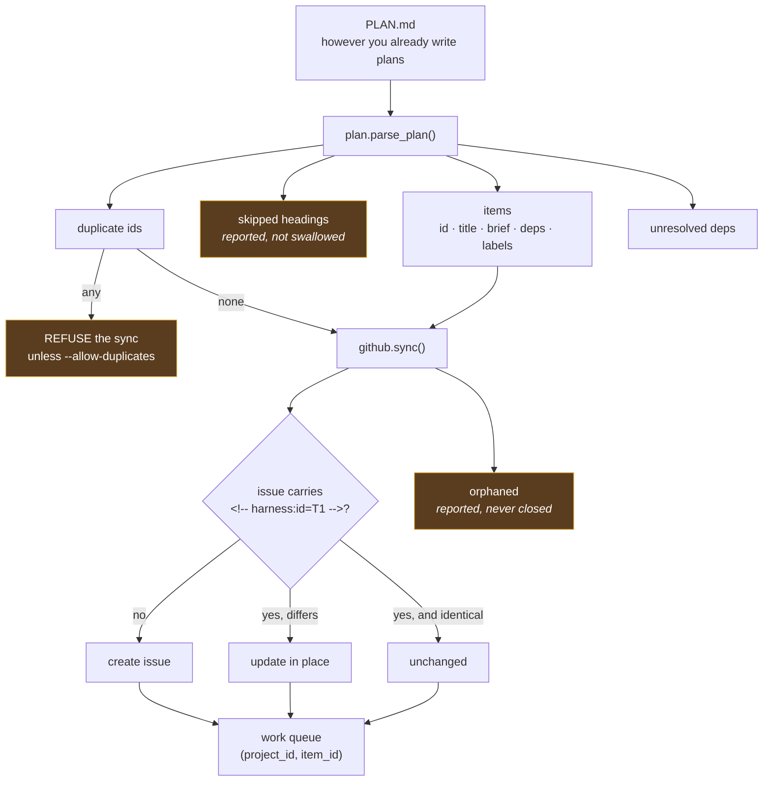
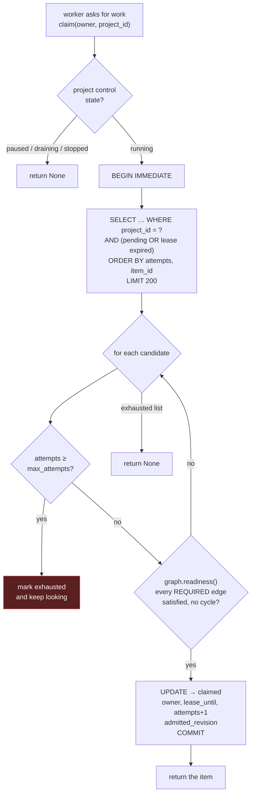
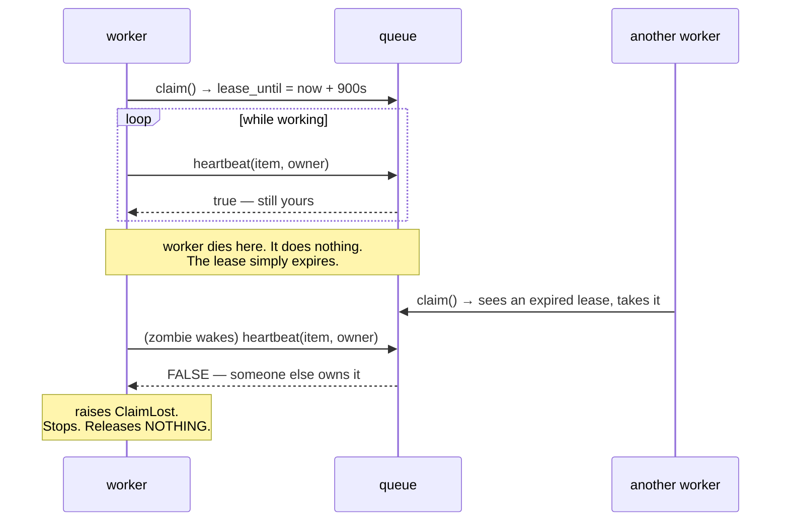
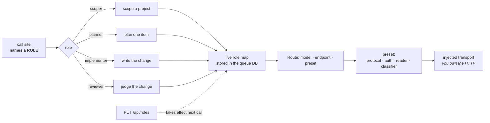
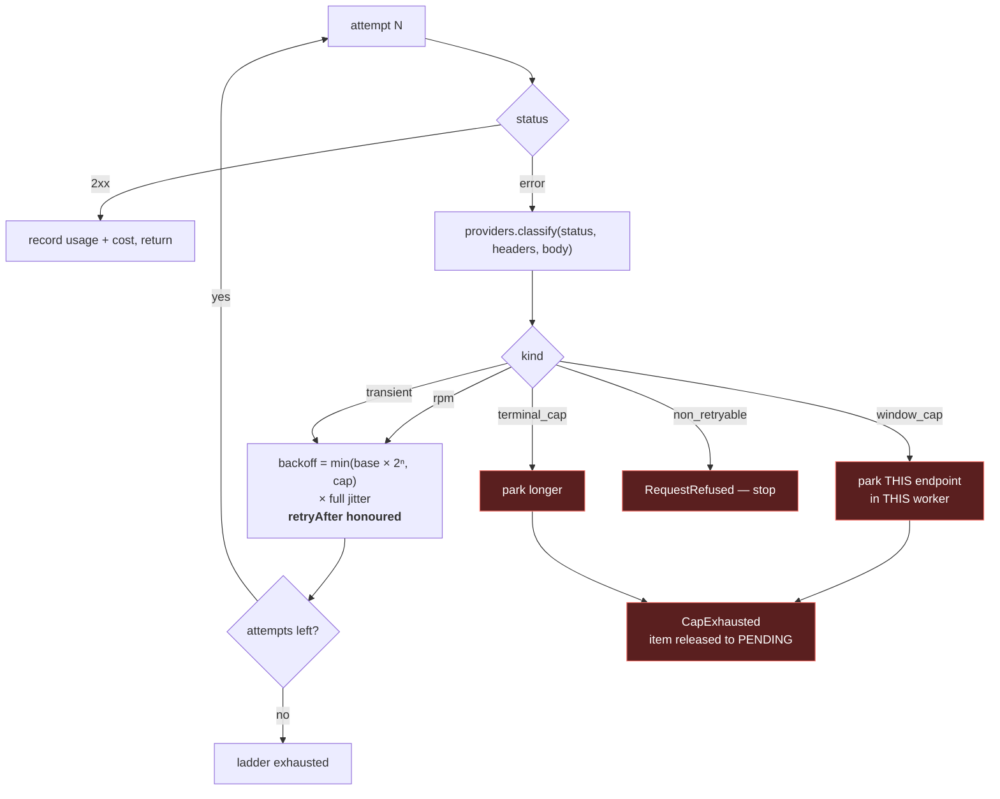
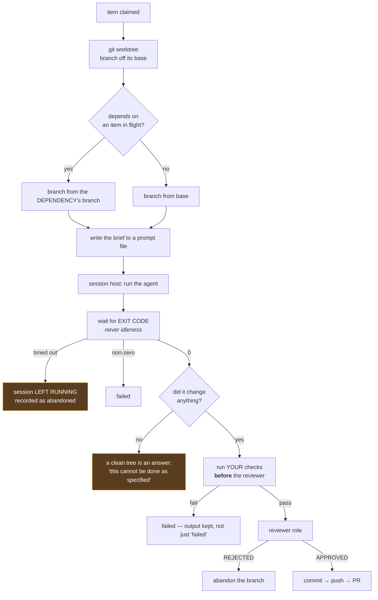
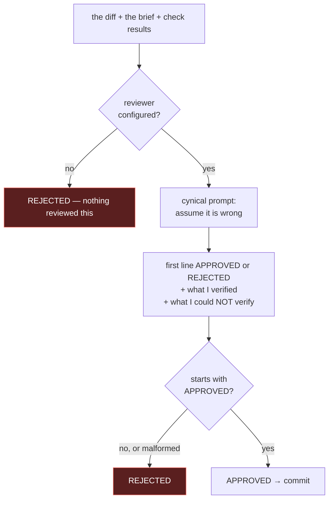
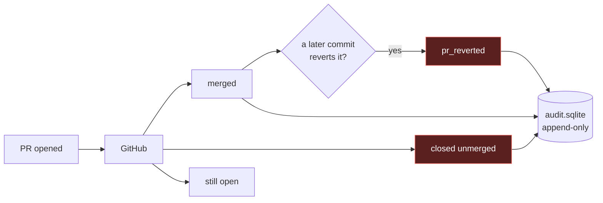

# Internals

A layer below [`ARCHITECTURE.md`](ARCHITECTURE.md). That one says what the
pieces are; this says what actually happens inside them — how a backlog gets
built, how work is triaged and claimed, where a model call goes and what
happens when it fails, and how a change becomes a commit, a pull request, and
eventually a merge or a revert.

Written against the code. Where behaviour is deliberate and non-obvious, the
reason is given, because the reason is the part that stops someone
"simplifying" it later.

---

## 1. Building the backlog



### What it recognises

Three shapes, all of which occur in plans people already write:

```markdown
### W1: Add a serial-number column      ← id + title heading
#### P0.1 — Repository                  ← dotted sub-item, distinct from P0
- [ ] W2 Reject duplicate serials       ← checkbox, id optional
| W3 | Show serials in the listing |    ← table row with an id column
```

The dotted form is not cosmetic. Real plans nest work under a phase, and
without it every sub-item collapses onto its parent: eleven distinct items
became three, and the sync then refused the plan for stating the same id three
times. **One cause, two symptoms, and the duplicate report pointed at the
wrong thing.** Found by parsing a plan nobody on this project had written.

### What it refuses, and why

| | |
|---|---|
| **Duplicate ids** | Each id becomes exactly one issue, so two would create two. `--allow-duplicates` collapses them keeping the richest description — which is right when a plan states a phase in §7 and again in an appendix. |
| **Closing anything** | The plan says what work *is*; the issue says where it *got to*. An item vanishing from a document is usually an edit and occasionally a mistake, never grounds to close work. Orphans are reported and left alone. |
| **Stripping labels** | The label check is a subset, not equality. Labels a human added on GitHub are theirs; a sync that removed them would make the backlog hostile to use. |

### The skipped count is part of the answer

```
3 work items, 2 headings skipped as narrative
```

Most headings in a real plan *are* narrative, so a non-zero skip count is
normal. A large one relative to items means the plan does not use a recognised
shape — and the parser would rather say so than quietly find three items in a
fifty-item document.

### Identity is a marker, not a title

Matching is on `<!-- harness:id=T1 -->` in the issue body. Titles get improved;
matching on them forks one item into two the first time someone rewords it.

> **Adopting an existing repo:** issues created by hand carry no marker, so a
> sync sees zero existing items and creates a full duplicate set. Seed the
> queue from the issues instead, or back-fill markers first.

---

## 2. Triage: which item runs next



**Ordering is `attempts, item_id`.** An item that has failed twice sinks below
one that has never been tried, so a poison item cannot monopolise a worker —
it gets a turn, at the back.

**The whole selection and the claim are one `BEGIN IMMEDIATE` transaction.**
Two workers racing therefore cannot both win: the loser's transaction sees the
row already claimed. This is exercised by real threads, not simulated
ordering — 8 workers over 200 items, asserting every item is claimed exactly
once. It is the one invariant whose failure silently duplicates or destroys
work rather than raising.

**`LIMIT 200`** because the whole eligible backlog used to be loaded into
memory inside the write transaction on every claim, holding the write lock
longer the larger the backlog got.

### The dependency graph decides admission

`depends_on` is a list of strings on the wire, and each string is a **token**
with a grammar. The token says what kind of thing is being waited for, and the
kind is what makes the answer decidable:

| Token | Target kind | Resolved against |
|---|---|---|
| `W1` | `local_work` | a work row in this project |
| `external:RESOLVER:ID` | `external_reference` | a stored outcome from `RESOLVER` |
| `decision:D9` | `human_decision` | a decision recorded as work here |
| `project:OTHER/W1` | `cross_project_work` | a work row in `OTHER` |
| `?W1` | any of the above, **advisory** | reported, never gating |

Each edge carries its source, target kind and identity, required-versus-
advisory, its resolver when external, a resolution state (`unresolved`,
`blocked`, `satisfied`), the evidence for that state, its provenance, and the
graph revision it was written at. That is the contract in
[`COORDINATION-PLANE.md`](COORDINATION-PLANE.md) §8, implemented in
`graph.py` rather than restated as a second, thinner design.

**A required target the graph cannot resolve is a blocker.** This reverses the
earlier rule, and the reversal is the point. A dependency absent from the queue
used to be treated as satisfied because plans reference work tracked
elsewhere — which is true, and which made a typo, an omitted item and a genuine
external reference indistinguishable. All three ran immediately. An external
reference is still perfectly legitimate; it just has to say so and have an
answer from a resolver, and a resolver that knows one tool's format lives in
`adapters/` and is imported only when a plan names it. Which module a resolver
name belongs to is declared in the distribution's
`agent_harness.dependency_resolvers` entry points — the same door route presets
use, and for the same reason: a dotted module path written into `graph.py`
would still be core knowing what a particular tracker is called.

**Dependencies still resolve only inside a project** unless the token says
otherwise. An id means one thing here and another there, so crossing the
boundary has to be spelled out as `project:OTHER/W1`.

**Cycles are named as cycles.** Two items that each require the other were
reported as "waiting", forever, one item at a time, with nothing saying the
wait could never end. `graph.cycles()` finds the loops and the readiness
explanation prints the path.

**Local targets are derived on every read; external ones are stored.** A local
edge's state comes straight from the work row, so it cannot go stale and there
is no second copy of the answer to disagree with the queue. An external
outcome is evidence obtained by I/O and has to be kept — but it is obtained by
`resolve_external`, never inside the claim transaction, because I/O inside the
write transaction that hands out work is how one slow ticket system stalls a
fleet.

### One revision, two checks

The graph revision moves when the declared graph changes or a resolver reports
something new — **not** when work merely finishes, which is work state.
Re-ingesting an unchanged plan therefore leaves the revision exactly where it
was, which is what stops a routine re-sync invalidating live claims.

`claim` records the revision it admitted at on the work row. The executor
re-runs *the same* `readiness()` call at the last cheap point before review
spends money and the checkpoint makes anything durable — in both the direct
API and hosted-session executors. Two implementations of "is it ready" would be
two answers, and the one that disagreed would be the one that let ineligible
work commit.

When that second check fails, the agent is **not** killed: it has already
reached a safe boundary, the branch is abandoned, the item returns to `pending`
and a `dependency_invalidated` event records the reason with both revisions in
it. It stays blocked until the dependency resolves or an operator records an
explicit override — and an override is scoped to the revision it was granted
at, so the next correction re-blocks the item.

`GET /api/work/{item_id}/readiness` and `GET /api/graph` publish all of this,
and `agent-harness graph report | export | rebuild` is the same information and
the recovery procedure at the command line. The edge table is derived from
`depends_on`, so it can be dropped and rebuilt; that is the whole of
[`MIGRATION-graph.md`](MIGRATION-graph.md).

### Claims are leases



A lock held by a dead process is a lock nobody can release, and the usual
workaround — a human clearing stale state — is exactly the unattended failure
the queue exists to prevent.

Both halves of that contract are enforced, and for a while only one was:
`heartbeat` guarded on owner while `release` did not, so a stalled worker
could surface late and mark an item done from work the new owner never did,
leaving the new owner running with nothing to release. `release` is now
owner-guarded too. Omitting the owner is an *administrative* override — the
operator retrying a stuck item through the API has no worker identity, and
guarding that would remove the one lever a human has over a wedged row.

---

## 3. Model routing



**A call site never names a model.** That is what makes re-routing a data
change rather than a code change: `PUT /api/roles` swaps the reviewer to a
different vendor mid-run, no restart. The map lives in the queue database
because the API process and the worker process are different processes — an
in-memory value could never be changed from outside the loop using it.

**The transport is injected, not imported.** The retry logic is therefore
testable without a network, and you keep whatever HTTP client you already have.

**A stored map overrides the command line.** That is the point of storing it,
but silently ignoring flags someone just typed is its own kind of lie, so a run
names which roles the command line lost.

### Route presets: adding a vendor without touching core

A `Provider` classified failures. The CLI's transport separately assumed one
gateway's completion path, one authentication header and one response envelope.
Neither knew about the other, which had two consequences: "add a vendor" meant
editing the transport function, and changing the classifier changed nothing
about what went on the wire.

They are separate concerns now. A route names, explicitly or through a preset:

| Part | What it decides | Core default |
|---|---|---|
| request adapter | URL, method, payload keys | `JsonChatRequest()` — POST the endpoint exactly as configured |
| authentication strategy | which header carries the credential | `BearerAuth()` — `Authorization: Bearer …`, omitted when there is no key |
| response reader | where the text and the token counts are | `JsonResponseReader()` — conservative; no text path, so it declines rather than guessing |
| failure classifier | what a rejection means for control flow | `GENERIC` — HTTP only |
| model, endpoint | on the route itself | — |
| price reference | what the price table calls this model | the model id |

A **preset** is one name for all four. The core preset is `generic` and it makes
no vendor-specific claim; every other one is an adapter or a plugin, and
`protocols.py` never imports one. It resolves them **by name**, in this order,
loading only the name that was asked for:

1. `protocols.register(preset)` — built in this process;
2. `HARNESS_ROUTE_PRESETS="name=module:attribute,…"` — named in configuration;
3. an `agent_harness.route_presets` entry point — published by an installed
   distribution.

The third is how this distribution's own `chat-completions` and `claw-bay`
presets are reached, which is deliberate: if the shipped ones took a shortcut
through an import, "addable without editing core" would be true only for the
vendors we happen to ship.

```python
# somepackage/presets.py — in anyone's package
from agent_harness.protocols import BearerAuth, JsonChatRequest, JsonResponseReader, RoutePreset
from agent_harness.providers import VendorEnvelopeProvider

PRESET = RoutePreset(
    name="somevendor",
    request=JsonChatRequest(path="/v2/generate", model_key="model_id", messages_key="turns"),
    auth=BearerAuth(header="x-api-key", scheme=""),      # no scheme word
    reader=JsonResponseReader(text_paths=("result.reply",), usage_key="counters"),
    classifier=VendorEnvelopeProvider(vendor_field="problem", quota_categories=("budget",)),
)
```

```toml
# ...declared once, in that package's pyproject
[project.entry-points."agent_harness.route_presets"]
somevendor = "somepackage.presets:PRESET"
```

```json
// ...and named by a route. PUT /api/roles
{"roles": {"implementer": {"model": "m", "endpoint": "https://…", "preset": "somevendor"}}}
```

Nothing in `model_client.py`, `providers.py` or `protocols.py` changes for that,
and `tests/test_route_conformance.py` runs a preset registered from outside
through the whole conformance suite to keep it that way.

**`provider` versus `preset`.** The older `provider` field only ever chose a
*classifier* — the wire shape came from whichever transport the deployment had
wired in — so it still does exactly that: the named preset's classifier is
taken, and the protocol comes from the deployment default (`run --preset` /
`serve --preset`, default `chat-completions`). A role map written before this
existed therefore calls the same URL with the same credential and classifies
the same way. `preset` wins where both are given.

**Host detection is a suggestion and nothing else.** `protocols.suggest(endpoint)`
will look at a hostname and say which preset is probably meant, and the CLI
prints it at startup. It never chooses one. Hosts are proxied, renamed,
self-hosted and shared; a protocol nobody configured is a request sent to a URL
nobody chose, and the first symptom would be a failure the classifier cannot
explain.

**An unknown preset name is loud, not substituted.** A route naming one that
does not resolve logs a warning and falls back to the generic classifier — a
role map is edited live, and one misspelling must not take down the readiness
report that would show the operator what they typed. The CLI is stricter: it
resolves its default preset before anything claims work, and refuses with the
list of declared names rather than discovering the problem on the first call.

---

## 4. Retry: a 429 is not one thing



### Why classification exists at all

`429` covers "slow down" (retry in a moment), "your 5-hour budget is gone"
(hours), "your weekly budget is gone" (days) and "we refuse this" (never).
Vendors bury the difference in a body field, and a harness that does not read
it cannot tell a half-second problem from a week-long one.

Getting it wrong is expensive **in both directions**:

- Retrying a spent cap is a busy-wait that burns quota checking whether quota
  exists.
- A *fleet-wide* cooldown in response to one worker's 429 does not merely stall
  the fleet — it **phase-locks** it. Every worker wakes together, bursts
  together and is limited together, which is exactly the shape a rate limiter
  exists to reject.

So: classify first, never retry a cap, keep every reaction **per worker and per
endpoint**, and jitter.

### Full jitter, not a jittered cap

```python
delay = random() * min(base * 2 ** attempt, cap)
```

The cap bounds the curve, not the result. Capping after jittering
re-synchronises exactly the workers you were trying to spread out.

`retryAfter` is read from the **body as well as the header**, taking whichever
is larger — some vendors only put it in the envelope, and believing the smaller
of the two is how you get limited again immediately.

### Budget exhaustion is not failure

`CapExhausted` releases the item back to `pending`, not `failed`. Nothing was
wrong with the work; the account ran out of money. In `serve()` the worker
sleeps a poll and asks again rather than exiting, because the endpoint park
already knows how long to wait.

---

## 5. Completion: from an agent's changes to a pull request



**A worktree per item.** Two agents editing one working tree is a data race
that corrupts both, and the failure looks like a bad model rather than a bad
harness — which is the worst kind of bug to chase.

**Dependent work is stacked.** An item written against its dependency's tree is
branched from that dependency, not from `main`. This was found the hard way:
`patch --fuzz` applied a diff to a base silently missing the function it
depended on, and *reported success*.

**Completion is the exit code, never idleness.** A CLI agent sitting at a
prompt having printed its answer is idle and very much not finished, and one
waiting for approval looks identical.

**A timeout leaves the session alive.** It holds the agent's context, which is
the only thing making the item resumable by a human. It is recorded in
`abandoned_sessions` and reaped after 6 hours if nobody comes back — kept means
owned, not forgotten, or "preserved deliberately" and "leaked" become the same
thing after a week.

**Cheap checks run before the expensive one.** Paying a model to tell you the
build is broken is paying the dearest gate to catch what the cheapest one
already caught.

**A clean tree is a real answer.** An agent that concludes the task is
impossible as written and says so is behaving correctly; inventing a way around
it is not.

---

## 6. Review



### It fails closed, twice

No reviewer configured returns `REJECTED — nothing reviewed this`, and any
verdict not starting with `APPROVED` counts as rejected, so a truncated or
malformed reply rejects. **Unreviewed work must never pass as reviewed**, and
the asymmetry is deliberate: approving work that does not do what was asked
reaches a pull request carrying the word "reviewed" and costs someone much
later; an unnecessary rejection costs one retry.

### Cynical by construction, not by adjective

The prompt opens by telling the reviewer to assume the change is wrong, and
requires it to produce two lists before its verdict means anything:

- **What I verified** — specific things checked against the task. *Naming
  nothing is itself a rejection.*
- **What I could not verify** — anything the diff claims that the diff alone
  does not show.

That second list is the useful one. Most changes that fail review fail because
they did something *adjacent* to what was asked, or claimed more than they did
— not because they were obviously broken.

### Independence is checked, not assumed

`reviewer_independence()` compares the reviewer's route to the implementer's
and reports when they are the same model, or merely the same vendor:

```
WARNING: reviewer and implementer are the same model (m):
         every review is a model grading its own work
```

This was previously documented in three places and enforced in none. It is
**reported rather than refused** — running a single model is a legitimate
deliberate choice, and blocking it would be the harness overruling an operator
about their own budget. What it must not be is a surprise.

It compares the reviewer to the implementer that **actually runs**. In session
mode that is the agent process, not a routed model, so the verdict says so
rather than comparing two routes that never meet: the configured `implementer`
is never called there, and a warning about it would be about a pairing that
does not exist.

---

## 7. Merge, and the only honest quality metric

Everything above is a proxy. A reviewer approved it; the checks passed. None of
that says the change was any *good* — only what happens to it afterwards does,
and that happens outside the harness.



`reconcile.py` fetches this and records it. Three properties:

**Two facts, never one that changes its mind.** A PR merged today and reverted
next week produces `pr_merged` and then `pr_reverted`, in order, both true when
recorded. Rewriting the merge would make history depend on when you looked.

**Stamped with their own time, not the clock.** The revert event uses the
revert commit's `%ct`; the closed event uses GitHub's `closedAt`. Using
`time.time()` changes the event's content-derived identity on every pass, so
every reconciliation re-records the same revert — wrong, and unbounded. That
bug shipped and was caught by an idempotence test that only failed one run in
six, because two `time.time()` calls in one fast run can return the same float.

**Unattributed outcomes are skipped, not counted.** Repositories are full of
pull requests the harness never made — dependabot, humans. An outcome belonging
to no item inflates every rate it appears in.

### Why revert rate is the one that matters

| Metric | What it actually measures |
|---|---|
| Review approval rate | Whether a reviewer agreed |
| Check pass rate | Whether the cheap gate works |
| Merge rate | Whether a human accepted it |
| **Revert rate** | Whether accepting it was right |

Approval rate and revert rate come apart exactly when it matters. A harness
tracking only the first will report improving quality right up until someone
looks at the repository.

---

## 8. What every stage writes down

Each transition above emits an event, and each event lands in an append-only
store that outlives the queue:

| Stage | Outcome recorded |
|---|---|
| Claim | `started` |
| Agent | `agent_started` · `waiting_for_input` · `agent_timeout` · `agent_failed` · `agent_finished` |
| Lease lost | `claim_lost` |
| Checks | `checks_passed` · `checks_failed` |
| Review | `review_approved` · `review_rejected` |
| Delivery | `committed` · `pushed` · `pr_opened` |
| Budget | `budget_exhausted` |
| Cleanup | `session_reaped` |
| Outside | `pr_merged` · `pr_closed_unmerged` · `pr_reverted` |

Model calls additionally carry tokens and **the price that was applied to
them** — not just tokens, because applying today's rates to last year's usage
is a projection rather than history, and it silently rewrites the past every
time a vendor reprices.

See [`AUDIT-PLAN.md`](AUDIT-PLAN.md) for what is worth measuring on top of
this, and the rules that keep the numbers defensible.
